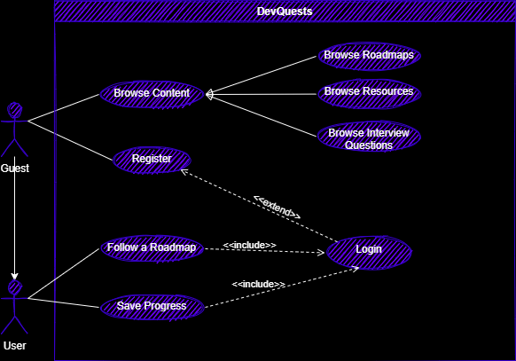

<!-- \ -->
<!--
'########::'########:'##::::'##::'#######::'##::::'##:'########::'######::'########::'######::
 ##.... ##: ##.....:: ##:::: ##:'##.... ##: ##:::: ##: ##.....::'##... ##:... ##..::'##... ##:
 ##:::: ##: ##::::::: ##:::: ##: ##:::: ##: ##:::: ##: ##::::::: ##:::..::::: ##:::: ##:::..::
 ##:::: ##: ######::: ##:::: ##: ##:::: ##: ##:::: ##: ######:::. ######::::: ##::::. ######::
 ##:::: ##: ##...::::. ##:: ##:: ##:'## ##: ##:::: ##: ##...:::::..... ##:::: ##:::::..... ##:
 ##:::: ##: ##::::::::. ## ##::: ##:.. ##:: ##:::: ##: ##:::::::'##::: ##:::: ##::::'##::: ##:
 ########:: ########:::. ###::::: ##### ##:. #######:: ########:. ######::::: ##::::. ######::
........:::........:::::...::::::.....:..:::.......:::........:::......::::::..::::::......:::
-->

\newpage

# REMERCIEMENTS

I want to take this chance to thank the great people who helped me through the process of creating this project idea and realization.  

First of all, I'd like to thank Mrs. Fatimaezzahra Sedraoui, who gave me great insights into the project idea and answered all my questions with great care while watching over my progression.  

Also, I'd like to thank my seniors here on YouCode, who helped me whenever I reached out to them, and who gave me so much knowledge and experience to create great projects.  

And to finalize, I'd like to thank anyone who helped me become a better version of myself and learn from my mistake.  

\newpage

# INTRODUCTION

DevQuests is an e-learning platform for developers. It is a platform that allows you to learn and practice coding and programming in a fun and engaging way.

## Problem

When you want to learn how to code, normally you'll go to a specialized school, or a coding bootcamp. But here in Morocco, there are not enough schools nor bootcamps to meet the demand as for example, YouCode can offer at most 300 places, but the demand this year reached over 6000+.

## Solution

To satisfy the demand, DevQuests offers an online platform that allows you to learn and practice coding in a fun and engaging way that simulates the real world coding bootcamps and schools, with projects and challenges that are based on the real world use cases.

## Project Glossary

- **_Roadmaps_**: Career paths which the user can follow.
- **_Modules_**: Skills needed for a specific roadmap.
- **_Nodes_**: Skills needed for a specific module.
- **_Resources_**: Ressources to learn a skill or a set of skills.
- **_Interview Questions_**: Questions to help the user understand the modules.

## Project Team

- Mohammed-Aymen Benadra (#aymenBenadra) – CEO / Developer / Designer – aymanbenadra16@gmail.com

\newpage

# CONTENT STRUCTURE

## Site map

## Content types

- User: Timeless
- Roadmap: Timeless
- Module: Roadmap order
- Resource: Timeless
- Interview Question: Timeless

## Taxonomies

- **Learning Mode**
  - Relaxed
  - Normal

\newpage

# MODELIZATION

## Use Case Diagram

## Class Diagram

## Sequence Diagram for Choosing a Roadmap

## Sequence Diagram for Authentification with JWT

\newpage

# UI/UX

## Graphic Charter

[Graphic Charter Figma Link](https://www.figma.com/file/UtTIub4HNUiwNsEqmdtoMR/DevQuests-Graphic-Charter)

[Design Figma Link](https://www.figma.com/file/6KiHVO2VvatHyZjZpq7Vc9/DevQuests---File-Rouge)

[Sitemap Link](https://www.gloomaps.com/wbCdtfkjRp)

\newpage

# REALISATION

## Login page

## Sign up page

## Homepage

## Roadmaps page

## Roadmap page

## Questions page

## Resources page

## Dashboard page

## 404 page

\newpage

# TECHNOLOGICAL CHOICES

## Technologies

### Modelization

- **UML**

  > [UML](https://en.wikipedia.org/wiki/UML) is a model-based approach to software development. It is a simple, yet powerful approach to software design.

### Frontend

- **Html 5**:

  > [HTML5](https://en.wikipedia.org/wiki/HTML5) is a markup language used for structuring and presenting content on the World Wide Web. It is the fifth and final major HTML version that is a World Wide Web Consortium recommendation. The current specification is known as the HTML Living Standard.

- **CSS 3**:

  > [CSS 3](https://en.wikipedia.org/wiki/Cascading_Style_Sheets) is the latest evolution of the Cascading Style Sheets (CSS) standard. It is a style sheet language used for describing the presentation of a document written in a markup language like HTML.

  - **TailwindCSS**

    > [Tailwind CSS](https://tailwindcss.com/) is a utility-first CSS framework for rapidly building custom, high performance, and accessible websites.

- **Javascript ES6**
  
  > [JavaScript](https://en.wikipedia.org/wiki/JavaScript) is a high-level, interpreted programming language. It is a language which is also characterized as dynamic, weakly typed, prototype-based, and multi-paradigm.

- **React.js**
  
  > [React.js](https://reactjs.org/) is an open-source JavaScript library for building user interfaces. It is maintained by Facebook and a community of individual developers and companies.

### Backend

- **PHP** -> **_SakamotoMVC_**

  > [PHP](https://en.wikipedia.org/wiki/PHP) is a server-side scripting language designed for web development but also used as a general-purpose programming language. [SakamotoMVC](https://github.com/aymenBenadra/SakamotoMVC) is a PHP framework for creating MVC applications that I created from scratch with Middlewares, Controllers, Models, Views, and Routes.

### Database

- **SQL** -> _MySQL_

  > [MySQL](https://en.wikipedia.org/wiki/MySQL) is a popular open-source relational database management system (RDBMS) based on the [SQL](https://en.wikipedia.org/wiki/Structured_query_language) language.

## Tools

### Modelization tool

- **Draw.io**

  > [Draw.io](https://www.draw.io/) is a free, open-source diagramming software.

### Sitemap generator

- **Gloomaps**

  > [Gloomaps](https://www.gloomaps.com/) is a free online map generator.

### Planning Tool

- **Trello**

  > [Trello](https://trello.com/) is a web-based project management tool with a simple interface that’s easy to use and fun to work with.

### Design Tool

- **Figma**

  > [Figma](https://www.figma.com/) is a free, open-source tool for creating and sharing vector graphics.

### Package Managers

- **Yarn** -> _Frontend_

  > [Yarn](https://yarnpkg.com/) is a package manager for JavaScript and dependencies.

- **Composer** -> _Backend_

  > [Composer](https://getcomposer.org/) is a dependency manager for PHP.

### Build Tools

- **Vite** -> _Builder_

  > [Vite](https://vite.dev/) is a JavaScript build tool for modern web applications.

- **Webpack** -> _Bundler_

  > [Webpack](https://webpack.js.org/) is a module bundler for modern JavaScript applications.

- **Babel** -> _Transcompiler_

  > [Babel](https://babeljs.io/) is a JavaScript compiler.

- **ESLint** -> _Linter_

  > [ESLint](https://eslint.org/) is a JavaScript and TypeScript linter.

### Git & Version Control

- **Git** -> [_GitHub_](https://github.com)

  > Git is a free and open source distributed version control system designed to handle everything from small to very large projects with speed and efficiency.

\newpage

# FUNCTIONALITY

There are many functionalities that needs to be implemented for the project to be concidered done, and we can devide them to Primary and Secondary functionalities.

## Primary Functionalities

|  Fonctionality   | _FN0001: Choose Roadmap_ |
| :--------------: | :----------------------: |
| **Objectif** | User can Browse and Choose a Roadmap |
| **Description** | A Grid-view of Roadmap cards, each has information about the Roadmap and how much time needed to complete it. Users can Choose one Roadmap at a time and if they want to change it later a warning will appear. |
| **Constraints** | - |
| **Dependencies** | - |
| **Priority** | High |

| Fonctionality | _FN0002: Select Module_ |
| :-----------: | :---------------------: |
| **Objectif** | User can Browse and Select a module from a Roadmap |
| **Description** | A Module is a Skill or a set of Skills that the user needs to learn, each skill should show information, Resources when selected |
| **Constraints** | - |
| **Dependencies** | FN0001 |
| **Priority** | High |

| Fonctionality | _FN0003: Authentification_ |
| :-----------: | :------------------------: |
| **Objectif** | User can Sign up or Log in |
| **Description** | A Guest can Sign up by providing _full name_, _email_, _username_, _password_, and an _avatar_ will be generated automatically if signed up successfully. User can Log in by providing _username_/_email_, and _password_. Auth helps guarding data in database rather than in local storage so nothing happens to it. |
| **Constraints** | - |
| **Dependencies** | - |
| **Priority** | Medium |

## Secondary Functionalities

| Fonctionality | _FN0004: Show Interview Question_ |
| :-----------: | :-------------------------------: |
| **Objectif** | User can See an interview question |
| **Description** | Users can see interview questions with their answers |
| **Constraints** | - |
| **Dependencies** | - |
| **Priority** | low |

| Fonctionality | _FN0005: Choose Learning Mode_ |
| :-----------: | :----------------------------: |
| **Objectif** | User can Choose a prefered Learning mode |
| **Description** | Learning Mode is how the user wants to learn and how much time is availlable |
| **Constraints** | - **Relaxed**(_Own Pace_): Continue without a timer - **Normal**(_Part-time_): Standard time for must of the users - **Hardcore**(_Immersive_): Half the standard time |
| **Dependencies** | FN0001 |
| **Priority** | low |

| Fonctionality |_FN0006: Search Resources_|
| :-----------: | :----------------------: |
| **Objectif** | User can search for resources |
| **Description** | User can search for a resource via tags, keywords, or any information regarding them |
| **Constraints** | - |
| **Dependencies** | FN0002 |
| **Priority** | low |

\newpage

# IMPORTANT CONSTRAINTS

## Accessibility

For the best user experience the use of semantic Html5 is a must, also with the usage of best practice and Aria attributes.

## Browser And Device Support

- Device support: most of the devices used including **Desktop**, **Tablet**, and **Mobile** devices.
- Browser support: most of the browsers excluding IE as it's deprecated.
- Features support: most of the latest features are supported thanks to Babel, PostCSS, AutoPrefixer and other packages.

## Hosting

- Back-end - PHP API - **Heroku**
  - PHP
  - Apache
  - Composer
  - ClearDB MySQL
- Frontend - React UI - **Vercel**
  - Nodejs
  - Yarn
  - Vite

## Ongoing Support And Maintenance

For staying up to date with the industry we'll need to:

- Add new features
- Fix bugs and issues
- Change or tweak the UI
- Update the roadmaps we provide
- Add new content in a timely manner

## Assumptions

As I'm the only one working on the project it's a given that I'll be responsible for all the tasks, which include but not limited to:

- Content addition
- Design and layout customisation options
- Migrating the site to the live server
- Ongoing maintenance
- SEO
- Hosting

\newpage

# PLANNING

## Kanban Board (Trello)

## Milestones

- [x] Specifications - This document
- [x] Modelization
- [x] Database
- [x] Wireframes
- [x] Designs
- [x] Back-end - API Development
  - [x] Roadmaps endpoint
  - [x] Resources endpoint
  - [x] Interview Questions endpoint
  - [x] Auth endpoint
- [x] Front-end - UI Development
  - [x] Homepage
  - [x] Login/Signup
  - [x] Roadmaps page
  - [x] Roadmap page
  - [x] Questions page
  - [x] Resources page
  - [x] Dashboard
  - [x] Profile page
  - [x] 404 page
- [x] Release v1.0

## Phases

| Phase          |     Deadline     |
| :------------- | :--------------: |
| Specification  | March 21st, 2022 |
| Modelization   |      2 Days      |
| Database       |     10 Days      |
| Wireframes     |      2 Days      |
| Designs        |      7 Days      |
| Back-end - API |     15 Days      |
| Front-end - UI |     25 Days      |
| Release v1.0   | June 3rd , 2022  |

\newpage

# Conclusion & Perspectives

I tried my best to outline the project in a way that it's easy to understand and built it with scalability in mind so that it can be improved with more features and better user experience over time. And as this project is the starting point for my own Explorer project, I'll be adding more features and improving the UI and UX even after turning it into a full-fledged project.

There are many features that I have in mind to add, but I'll be adding them gradually as I progress more in the development of the project.
