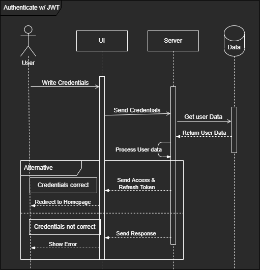
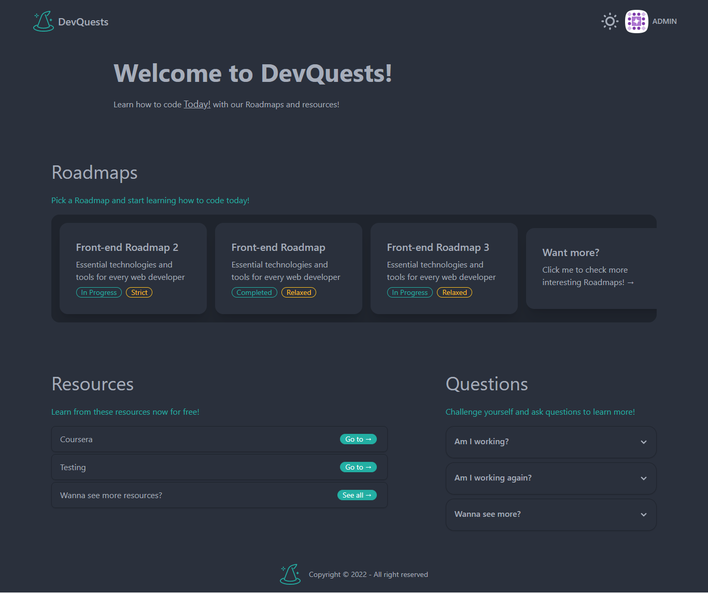
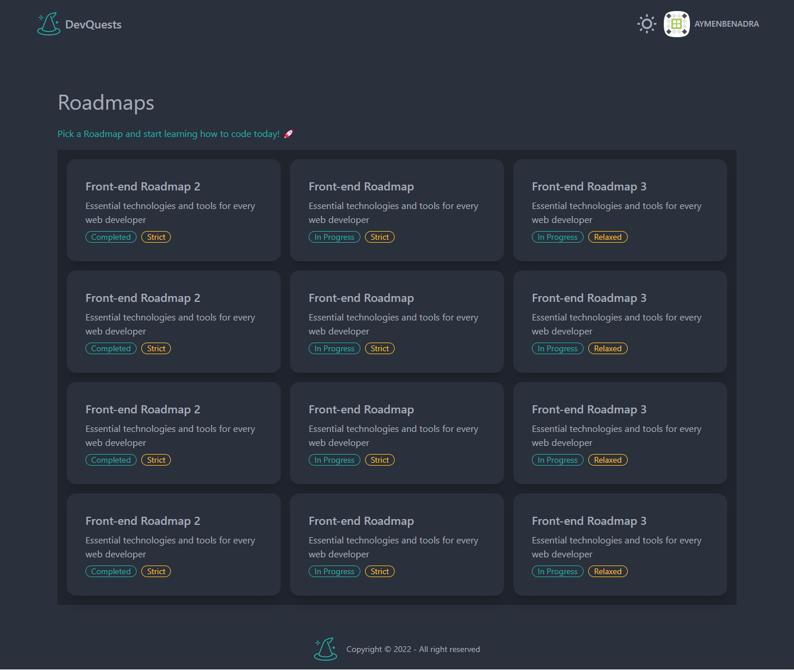
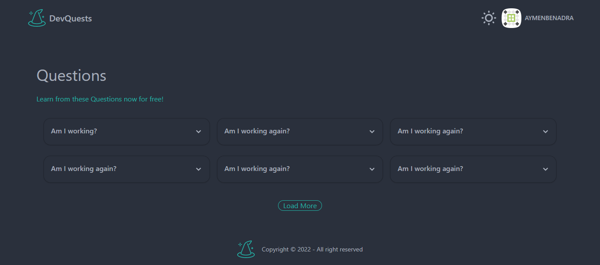
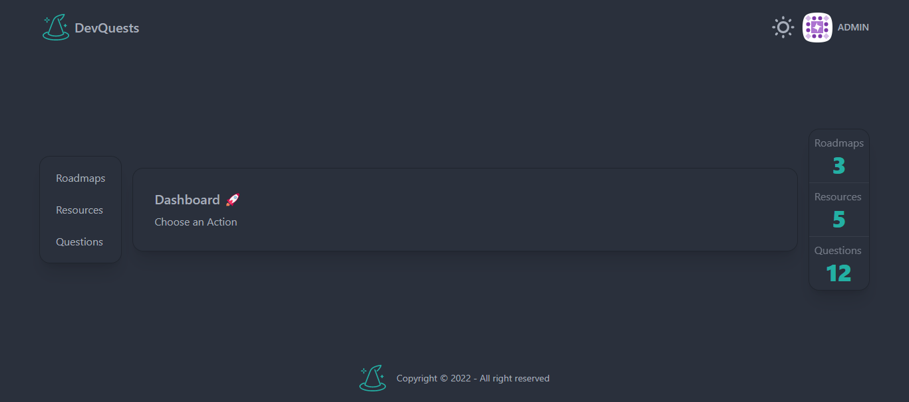

<!-- \ -->
<!--
'########::'########:'##::::'##::'#######::'##::::'##:'########::'######::'########::'######::
 ##.... ##: ##.....:: ##:::: ##:'##.... ##: ##:::: ##: ##.....::'##... ##:... ##..::'##... ##:
 ##:::: ##: ##::::::: ##:::: ##: ##:::: ##: ##:::: ##: ##::::::: ##:::..::::: ##:::: ##:::..::
 ##:::: ##: ######::: ##:::: ##: ##:::: ##: ##:::: ##: ######:::. ######::::: ##::::. ######::
 ##:::: ##: ##...::::. ##:: ##:: ##:'## ##: ##:::: ##: ##...:::::..... ##:::: ##:::::..... ##:
 ##:::: ##: ##::::::::. ## ##::: ##:.. ##:: ##:::: ##: ##:::::::'##::: ##:::: ##::::'##::: ##:
 ########:: ########:::. ###::::: ##### ##:. #######:: ########:. ######::::: ##::::. ######::
........:::........:::::...::::::.....:..:::.......:::........:::......::::::..::::::......:::
-->

\newpage

# REMERCIEMENTS

Je souhaite profiter de cette occasion pour remercier les personnes qui m'ont aidé tout au long du processus de création de l'idée et de la réalisation de ce projet.

Tout d'abord, j'aimerais remercier Mme Fatimaezzahra Sedraoui, qui m'a donné un bon aperçu de l'idée du projet et a répondu à toutes mes questions avec beaucoup d'attention tout en veillant à ma progression.

J'aimerais également remercier mes aînés ici à YouCode, qui m'ont aidé chaque fois que je les ai contactés, et qui m'ont donné tant de connaissances et d'expérience pour créer de grands projets.

Et pour finir, j'aimerais remercier tous ceux qui m'ont aidé à devenir une meilleure version de moi-même et à apprendre de mes erreurs.

\newpage

# INTRODUCTION

DevQuests est une plateforme d'apprentissage en ligne pour les développeurs. Cette plateforme vous permet d'apprendre et de pratiquer le codage et la programmation de manière amusante et attrayante.

## Problem

Lorsque vous voulez apprendre à coder, normalement vous allez dans une école spécialisée, ou un bootcamp de codage. Mais ici au Maroc, il n'y a pas assez d'écoles ou de bootcamps pour répondre à la demande. Par exemple, YouCode peut offrir au maximum 300 places, mais la demande cette année a atteint plus de 6000+.

## Solution

Pour répondre à cette demande, DevQuests propose une plateforme en ligne qui vous permet d'apprendre et de pratiquer le codage de manière amusante et attrayante, en simulant les bootcamps et les écoles de codage du monde réel, avec des projets et des défis basés sur des cas d'utilisation réels.

## Glossaire du projet

- Feuilles de route : Des parcours professionnels que l'utilisateur peut suivre.
- Modules : Compétences nécessaires pour une feuille de route spécifique.
- Nœuds : Compétences nécessaires pour un module spécifique.
- Ressources : Ressources pour apprendre une compétence ou un ensemble de compétences.
- Questions d'entretien : Questions destinées à aider l'utilisateur àcomprendre les modules.

## Project Team

- Mohammed-Aymen Benadra (@aymenBenadra) – PDG / Developer / Designer – aymanbenadra16@gmail.com

\newpage

# STRUCTURE DU CONTENU

## Plan de site

## Types de contenu

- User: Intemporel
- Roadmap: Intemporel
- Module: Par ordre de feuilles de route
- Resource: Intemporel
- Interview Question: Intemporel

## Taxonomies

- **Mode d'apprentissage**
  - Détendu
  - Normal

\newpage

# MODELISATION

## Diagramme des cas d'utilisation

## Diagramme de classe

## Diagramme de séquence pour le choix d'une feuille de route

## Diagramme de séquence pour l'authentification avec JWT

\newpage

# UI/UX

## Charte Graphique

[Lien Charte Graphique Figma](https://www.figma.com/file/UtTIub4HNUiwNsEqmdtoMR/DevQuests-Graphic-Charter)

[Lien Design Figma](https://www.figma.com/file/6KiHVO2VvatHyZjZpq7Vc9/DevQuests---File-Rouge)

[Lien Plan de site](https://www.gloomaps.com/wbCdtfkjRp)

\newpage

# REALISATION

## Page de connexion

## Page d'inscription

## Page d'accueil

## Page de profil

## Page des feuilles de route

## Page de la feuille de route

## Page des questions

## Page des ressources

## Page du tableau de bord

## Page 404

\newpage

# LES CHOIX TECHNOLOGIQUES

## Technologies

### Modélisation

- **UML**

  > [UML](https://en.wikipedia.org/wiki/UML)  est une approche du développement logiciel basée sur des modèles. Il s'agit d'une approche simple, mais puissante, de la conception de logiciels.

### Frontend

- **Html 5**:

  > [HTML5](https://en.wikipedia.org/wiki/HTML5) est un langage de balisage utilisé pour structurer et présenter du contenu sur le World Wide Web. Il s'agit de la cinquième et dernière version majeure de HTML qui est une recommandation du World Wide Web Consortium. La spécification actuelle est connue sous le nom de HTML Living Standard.

- **CSS 3**:

  > [CSS 3](https://en.wikipedia.org/wiki/Cascading_Style_Sheets) est la dernière évolution de la norme des feuilles de style en cascade (CSS). Il s'agit d'un langage de feuille de style utilisé pour décrire la présentation d'un document écrit dans un langage de balisage comme le HTML.

- **TailwindCSS**

  > [Tailwind CSS](https://tailwindcss.com/) est un framework CSS à vocation utilitaire permettant de créer rapidement des sites Web personnalisés, performants et accessibles.

- **Javascript ES6**
  
  > [JavaScript](https://en.wikipedia.org/wiki/JavaScript) est un langage de programmation interprété de haut niveau. C'est un langage qui est également caractérisé comme dynamique, faiblement typé, basé sur des prototypes et multi-paradigme.

- **React.js**
  
  > [React.js](https://reactjs.org/) est une bibliothèque JavaScript open-source permettant de créer des interfaces utilisateur. Elle est maintenue par Facebook et une communauté de développeurs individuels et d'entreprises.

### Backend

- **PHP** -> **_SakamotoMVC_**

  > [SakamotoMVC](https://github.com/aymenBenadra/SakamotoMVC) est un framework [PHP](https://en.wikipedia.org/wiki/PHP) pour la création d'applications MVC que j'ai créé de toutes pièces avec des Middlewares, Controllers, Models, Views, et Routes.

### Database

- **SQL** -> _MySQL_

  > [MySQL](https://en.wikipedia.org/wiki/MySQL) est un système de gestion de base de données relationnelle (SGBDR) open source populaire basé sur le langage [SQL](https://en.wikipedia.org/wiki/Structured_query_language).

## Outils

### Outil de modélisation

- **Draw.io**

  > [Draw.io](https://www.draw.io/) est un logiciel de création de diagrammes gratuit et open-source.

### Générateur de plan du site

- **Gloomaps**

  > [Gloomaps](https://www.gloomaps.com/) est un générateur de cartes en ligne gratuit.

### Outil de planification

- **Trello**

  > [Trello](https://trello.com/) est un outil de gestion de projet en ligne doté d'une interface simple, facile à utiliser et agréable à manier.

### Outil de conception

- **Figma**

  > [Figma](https://www.figma.com/) est un outil gratuit et open-source pour la création et le partage de graphiques vectoriels.

### Gestionnaires de paquets

- **Yarn** -> _Frontend_

  > [Yarn](https://yarnpkg.com/) est un gestionnaire de paquets pour JavaScript et ses dépendances.

- **Composer** -> _Backend_

  > [Composer](https://getcomposer.org/) est un gestionnaire de dépendances pour PHP.

### Outils de construction

- **Vite** -> _Bâtisseur_

  > [Vite](https://vite.dev/) est un outil de construction JavaScript pour les applications web

- **Webpack** -> _Bundler_

  > [Webpack](https://webpack.js.org/) est un regroupeur de modules pour les applications.

- **Babel** -> _Transcompilateur_

  > [Babel](https://babeljs.io/) est un compilateur JavaScript.

- **ESLint** -> _Linter_

  > [ESLint](https://eslint.org/) est un linter JavaScript et TypeScript.

### Git et contrôle de version

- **Git** -> [_GitHub_](https://github.com)

  > Git est un système de contrôle de version distribué, gratuit et open source, conçu pour gérer tout, des petits aux très grands projets, avec rapidité et efficacité.

\newpage

# FONCTIONNALITÉ

Il existe de nombreuses fonctionnalités qui doivent être mises en œuvre pour que le projet soit considéré comme achevé, et nous pouvons les diviser en fonctionnalités primaires et secondaires.

## Fonctionnalités primaires

|  Fonctionnalité   | _FN0001: Choisir une feuille de route_ |
| :--------------: | :----------------------: |
| **Objectif** | Choisir une feuille de route |
| **Description** | grille de cartes de route, chacune contenant des informations sur la feuille de route et le temps nécessaire pour la compléter. Les utilisateurs peuvent choisir une feuille de route à la fois. S'ils veulent la modifier ultérieurement, un avertissement s'affiche. |
| **Constraints** | - |
| **Dependencies** | - |
| **Priorité** | élevée |

| Fonctionnalité | _FN0002: Sélectionner une module_ |
| :-----------: | :---------------------: |
| **Objectif** | Choisir une module de feuille de route |
| **Description** | peut parcourir et sélectionner un module à partir d'une feuille de route. |
| **Constraints** | - |
| **Dependencies** | FN0001 |
| **Priorité** | élevée |

| Fonctionnalité | _FN0003: Authentification_ |
| :-----------: | :------------------------: |
| **Objectif** | User can Sign up or Log in |
| **Description** | peut s'inscrire ou se connecter invité peut s'inscrire en indiquant son nom complet, L'adresse électronique, le nom d'utilisateur, le mot de passe et un avatar seront générés automatiquement si l'inscription est réussie. L'utilisateur peut se connecter en fournissant son nom d'utilisateur/email et son mot de passe. L'authentification permet de protéger les données dans la base de données plutôt que dans le stockage local afin que rien ne leur arrive. |
| **Constraints** | - |
| **Dependencies** | - |
| **Priorité** | Moyen |

## Fonctionnalités secondaires

| Fonctionnalité | _FN0004: Afficher des question d'entretien_ |
| :-----------: | :-------------------------------: |
| **Objectif** | utilisateur peut voir des questions d'entretien |
| **Description** | Les utilisateurs peuvent voir les questions d'entretien avec leurs réponses  |
| **Constraints** | - |
| **Dependencies** | - |
| **Priorité** | faible |

| Fonctionnalité | _FN0005: Choisir le mode d'apprentissage_ |
| :-----------: | :----------------------------: |
| **Objectif** | utilisateur peut choisir son mode d'apprentissage préféré. |
| **Description** | mode d'apprentissage est la manière dont l'utilisateur souhaite apprendre et combien de temps est disponible |
| **Constraints** | - **Détendu**: Continuer sans chronomètre - **Normal**: Temps standard pour la plupart des utilisateurs |
| **Dependencies** | FN0001 |
| **Priorité** | faible |

| Fonctionnalité |_FN0006: Rechercher une resource_|
| :-----------: | :----------------------: |
| **Objectif** | utilisateur peut rechercher des ressources |
| **Description** | utilisateur peut rechercher une ressource par le biais de balises, de mots-clés, ou toute information les concernant |
| **Constraints** | - |
| **Dependencies** | FN0002 |
| **Priorité** | faible |

\newpage

# CONTRAINTES IMPORTANTES

## Accessibilité

Pour une expérience utilisateur optimale, l'utilisation de Html5 sémantique est indispensable, de même que l'utilisation des meilleures pratiques et des attributs Aria.

## Prise en charge des navigateurs et des dispositifs mobiles

- Prise en charge des appareils : la plupart des appareils utilisés, y compris les ordinateurs de bureau, les tablettes et les appareils mobiles.
- Support des navigateurs : la plupart des navigateurs, à l'exception d'IE qui est déprécié.
- Prise en charge des fonctionnalités : la plupart des dernières fonctionnalités sont prises en charge grâce à Babel, PostCSS, AutoPrefixer et d'autres paquets.

## Hébergement

- Back-end - PHP API - **Heroku**
  - PHP
  - Apache
  - Composer
  - ClearDB MySQL
- Frontend - React UI - **Vercel**
  - Nodejs
  - Yarn
  - Vite

## Soutien et maintenance continus

Pour rester à jour avec l'industrie, nous devrons :

- Ajouter de nouvelles fonctionnalités
- Corriger les bogues et les problèmes
- Modifier ou affiner l'interface utilisateur
- Mettre à jour les feuilles de route que nous fournissons
- Ajouter du nouveau contenu en temps voulu

## Hypothèses

Étant donné que je suis le seul à travailler sur le projet, il est évident que je serai responsable de toutes les tâches, qui comprennent, entre autres, les suivantes :

- Ajout de contenu
- Options de personnalisation de la conception et de la mise en page
- Migration du site vers le serveur en ligne
- Maintenance continue
- SEO
- Hébergement

\newpage

# PLANIFICATION

## Tableau Kanban (Trello)

## Étapes importantes

- [x] Spécifications - Ce document
- [x] Modélisation
- [x] Base de données
- [x] Wireframes
- [x] Designs
- [x] Back-end - Développement API
  - [x] Roadmaps endpoint
  - [x] Resources endpoint
  - [x] Interview Questions endpoint
  - [x] Auth endpoint
- [x] Front-end - Développement UI/UX
  - [x] Page d'accueil
  - [x] Login/Signup
  - [x] Page des feuilles de route
  - [x] Page de la feuille de route
  - [x] Page des questions
  - [x] Page des ressources
  - [x] Tableau de bord
  - [x] Page de profil
  - [x] Page 404
- [x] Version v1.0

## Phases

| Phase           |      Délai       |
| :-------------- | :--------------: |
| Spécification   | March 21st, 2022 |
| Modélisation    |      2 Jours     |
| Base de données |     10 Jours     |
| Wireframes      |      2 Jours     |
| Designs         |      7 Jours     |
| Back-end - API  |     15 Jours     |
| Front-end - UI  |     25 Jours     |
| Release v1.0    | June 3rd , 2022  |

\newpage

# Conclusion et Perspectives

J'ai fait de mon mieux pour décrire le projet de manière à ce qu'il soit facile à comprendre et je l'ai construit en gardant à l'esprit l'évolutivité afin qu'il puisse être amélioré avec plus de fonctionnalités et une meilleure expérience utilisateur au fil du temps. Et comme ce projet est le point de départ de mon propre projet Explorer, j'ajouterai d'autres fonctionnalités et j'améliorerai l'interface utilisateur et l'interface utilisateur même après en avoir fait un projet à part entière.

Il y a beaucoup de fonctionnalités que j'ai en tête d'ajouter, mais je les ajouterai progressivement au fur et à mesure que j'avancerai dans le développement du projet.
