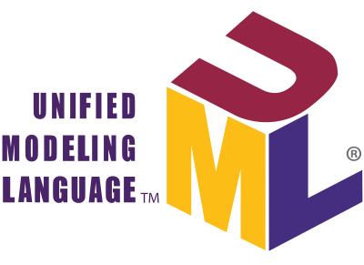
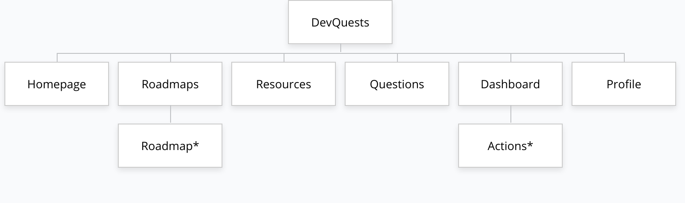
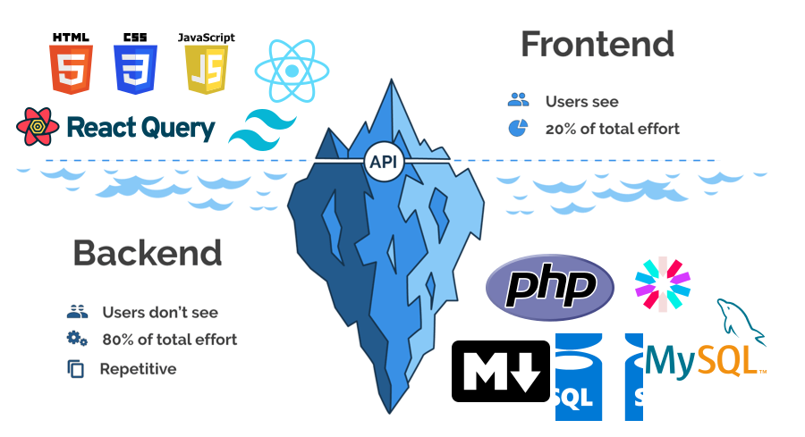

# DevQuests

DevQuests est une plateforme qui vous permet d'apprendre et de pratiquer le codage et la programmation d'une manière amusante et attrayante.

---

## Problem

- Manque d'orientation et de connaissances sur les écoles de codage au Maroc
- Nombre limité de places et de lieux
- Pas assez flexible pour les étudiants occupés
- Matériel pédagogique et méthodes d'enseignement dépassés ou mal conçus
- etc...

---

## Solution - DevQuests

- **Feuilles de route:** Un plan pour apprendre de manière structurée
- **Resources:** Une collection de matériel pédagogique gratuit
- **Questions d'entretien:** Une collection de questions pour préparer les entretiens

---

## Planning - [Trello](https://trello.com/b/gIMrwTLh/devquests)

---

## Modélisation - [UML](https://en.wikipedia.org/wiki/UML)

---

## Charte Graphique

---

## Plan du site

---

## Architecture (MVC + Multi-Repository)

- **Repository Frontend ([DevQuests-web](https://github.com/aymenBenadra/DevQuests-web))**
- **Repository Backend ([DevQuests-api](https://github.com/aymenBenadra/DevQuests-api)):**
  - Basé sur [SakamotoMVC](https://github.com/aymenBenadra/SakamotoMVC)

---

## Technologies

---

---

## Réalisation

---

## Code Source

---

## Conclusion et Prospective

---

### Merci pour votre attention!
