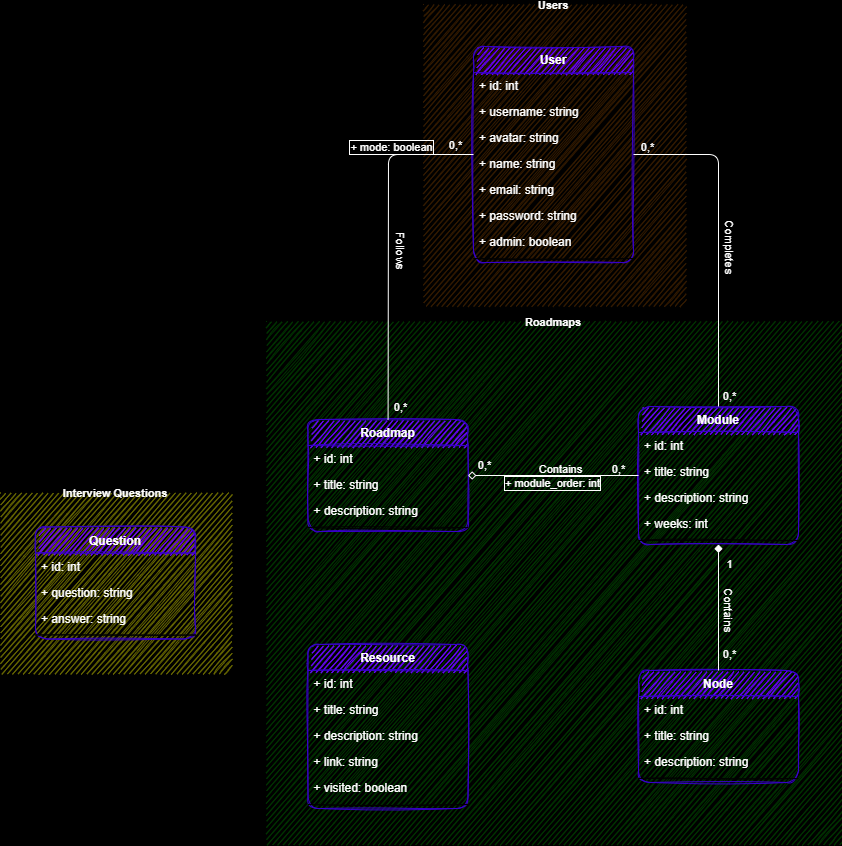

# $DevQuests$

<!--
'########::'########:'##::::'##::'#######::'##::::'##:'########::'######::'########::'######::
 ##.... ##: ##.....:: ##:::: ##:'##.... ##: ##:::: ##: ##.....::'##... ##:... ##..::'##... ##:
 ##:::: ##: ##::::::: ##:::: ##: ##:::: ##: ##:::: ##: ##::::::: ##:::..::::: ##:::: ##:::..::
 ##:::: ##: ######::: ##:::: ##: ##:::: ##: ##:::: ##: ######:::. ######::::: ##::::. ######::
 ##:::: ##: ##...::::. ##:: ##:: ##:'## ##: ##:::: ##: ##...:::::..... ##:::: ##:::::..... ##:
 ##:::: ##: ##::::::::. ## ##::: ##:.. ##:: ##:::: ##: ##:::::::'##::: ##:::: ##::::'##::: ##:
 ########:: ########:::. ###::::: ##### ##:. #######:: ########:. ######::::: ##::::. ######::
........:::........:::::...::::::.....:..:::.......:::........:::......::::::..::::::......:::
-->

DevQuests is a simple, open-source, community-driven platform for developers to create and share roadmaps for their careers.

## TABLE OF CONTENT

- [$DevQuests$](#devquests)
  - [TABLE OF CONTENT](#table-of-content)
  - [OVERVIEW](#overview)
    - [Project Glossary](#project-glossary)
  - [PROJECT TEAM](#project-team)
  - [PHASES](#phases)
  - [CONTENT STRUCTURE](#content-structure)
    - [Site map](#site-map)
    - [Content types](#content-types)
    - [Taxonomies](#taxonomies)
  - [MODELIZATION](#modelization)
    - [Use Case Diagram](#use-case-diagram)
    - [Class Diagram](#class-diagram)
  - [DESIGN](#design)
    - [Graphic Charter](#graphic-charter)
  - [TECHNOLOGICAL CHOICES](#technological-choices)
    - [Modelization](#modelization-1)
    - [Frontend](#frontend)
    - [Database](#database)
    - [Tools](#tools)
      - [Modelization tool](#modelization-tool)
      - [Planning Tool](#planning-tool)
      - [Design Tool](#design-tool)
      - [Package Managers](#package-managers)
      - [Build Tools](#build-tools)
      - [Git & Version Control](#git--version-control)
  - [FUNCTIONALITY](#functionality)
    - [Primary Functionalities](#primary-functionalities)
    - [Secondary Functionalities](#secondary-functionalities)
  - [ACCESSIBILITY](#accessibility)
  - [BROWSER AND DEVICE SUPPORT](#browser-and-device-support)
  - [HOSTING](#hosting)
  - [ONGOING SUPPORT AND MAINTENANCE](#ongoing-support-and-maintenance)
  - [ASSUMPTIONS](#assumptions)
  - [MILESTONES](#milestones)
  - [DEADLINES](#deadlines)
  - [Conclusion & Perspectives](#conclusion--perspectives)

## OVERVIEW

DevQuests is for whoever wants to learn programming to use as an interactive guide or a mentor in a way, where users can make sure they're making progress in the best way possible and that they're going on the right path for their dream career without the need to pay a large sum of money to some online or in-person Bootcamp.

DevQuests follows the learning by doing method by offering Detailed Roadmaps\* with required and optional Modules\*, selected Resources\* that will surely help the user understand what the module is about.

### Project Glossary

- ***Roadmaps***: Career paths which the user can follow.
- ***Modules***: Skills needed for a specific roadmap.
- **Nodes**: Skills needed for a specific module.
- ***Resources***: Ressources to learn a skill or a set of skills.
- **Interview Questions**: Questions to help the user understand the modules.

## PROJECT TEAM

- Mohammed-Aymen Benadra (#aymenBenadra) – CEO / Developer / Designer – aymanbenadra16@gmail.com

## PHASES

1. **Basic Roadmap web app**:
   - Users can *browse* and *choose* a Roadmap.
   - Users can *browse* and *select* a Module.
   - Users can *browse* and *visit* a Resource.
2. **Adding Content**:
   1. Add *Roadmaps*.
   2. Add *Resources* on each *Module*.
3. **Adding Secondary Functionalities**:
   1. Authentification with Github for saving progress.
   2. Add Learning Mode for time tracking (Relaxed, Normal, Hardcore).

## CONTENT STRUCTURE

### Site map

- [Home](#home)
  - [Login](#login)
  - [Signup](#signup)
  - [Logout](#logout)
- [404](#404)

### Content types

- User: Timeless
- Roadmap: Timeless
- Module: Roadmap order
- Resource: Timeless
- Interview Question: Timeless

### Taxonomies

- **Learning Mode**
  - Relaxed
  - Normal
  - Hardcore
- **Recommendation**
  - Required
  - Recommended
  - Optional

## MODELIZATION

### Use Case Diagram

### Class Diagram

## DESIGN

### Graphic Charter

[Graphic Charter](https://www.figma.com/file/UtTIub4HNUiwNsEqmdtoMR/DevQuests-Graphic-Charter?node-id=0%3A1)

## TECHNOLOGICAL CHOICES

### Modelization

- **UML**

### Frontend

- **Html 5**
- **CSS 3** -> *TailwindCSS* -> *Daisy UI*
- **Javascript ES6** -> *React.js* -> *React Router*

### Database

- **SQL** -> *MySQL*

### Tools

#### Modelization tool

- **Draw.io**

#### Planning Tool

- **Trello**

#### Design Tool

- **Figma**

#### Package Managers

- **Yarn** -> *Frontend*
- **Composer** -> *Backend*

#### Build Tools

- **Vite** -> *Frontend*
  - **Webpack** -> *Bundler*
  - **Babel** -> *Transcompiler*
  - **ESLint** -> *Linter*

#### Git & Version Control

- **Git** -> *GitHub*

## FUNCTIONALITY

There are many functionalities that needs to be implemented for the project to be concidered done, and we can devide them to Primary and Secondary functionalities.

### Primary Functionalities

|Fonctionality|*FN0001: Choose Roadmap*|
|:------------------------------:|:-------------------------------------:|
|**Objectif**|User can Browse and Choose a Roadmap|
|**Description**|A Grid-view of Roadmap cards, each has information about the Roadmap and how much time needed to complete it. Users can Choose one Roadmap at a time and if they want to change it later a warning will appear.|
|**Constraints**|-|
|**Dependencies**|-|
|**Priority**|High|

|Fonctionality|*FN0002: Select Module*|
|:------------------------------:|:-------------------------------------:|
|**Objectif**|User can Browse and Select a module from a Roadmap|
|**Description**|A Module is a Skill or a set of Skills that the user needs to learn, each skill should show information, Resources when selected|
|**Constraints**|-|
|**Dependencies**|FN0001|
|**Priority**|High|

|Fonctionality|*FN0003: Authentification*|
|:------------------------------:|:-------------------------------------:|
|**Objectif**|User can Sign up or Log in|
|**Description**|A Guest can Sign up by providing *full name*, *email*, *username*, *password*, and an *avatar* will be generated automatically if signed up successfully. User can Log in by providing *username*/*email*, and *password*. Auth helps guarding data in database rather than in local storage so nothing happens to it.|
|**Constraints**|-|
|**Dependencies**|-|
|**Priority**|Medium|

### Secondary Functionalities

|Fonctionality|*FN0004: Show Interview Question*|
|:------------------------------:|:-------------------------------------:|
|**Objectif**|User can See an interview question|
|**Description**|Users can see interview questions with their answers|
|**Constraints**|-|
|**Dependencies**|-|
|**Priority**|low|

|Fonctionality|*FN0005: Choose Learning Mode*|
|:------------------------------:|:-------------------------------------:|
|**Objectif**|User can Choose a prefered Learning mode|
|**Description**|Learning Mode is how the user wants to learn and how much time is availlable|
|**Constraints**|- **Relaxed**(*Own Pace*): Continue without a timer - **Normal**(*Part-time*): Standard time for must of the users - **Hardcore**(*Immersive*): Half the standard time|
|**Dependencies**|FN0001|
|**Priority**|low|

|Fonctionality|*FN0006: Search Resources*|
|:------------------------------:|:-------------------------------------:|
|**Objectif**|User can search for resources|
|**Description**|User can search for a resource via tags, keywords, or any information regarding them|
|**Constraints**|-|
|**Dependencies**|FN0002|
|**Priority**|low|

## ACCESSIBILITY

For the best user experience the use of semantic Html5 is a must, also with the usage of best practice and Aria attributes.

## BROWSER AND DEVICE SUPPORT

- Device support: most of the devices used including **Desktop**, **Tablet**, and **Mobile** devices.
- Browser support: most of the browsers excluding IE as it's deprecated.
- Features support: most of the latest features are supported thanks to Babel, PostCSS, AutoPrefixer and other packages.

## HOSTING

- Back-end - PHP API - **Heroku**
  - PHP
  - Apache
  - Composer
  - ClearDB MySQL
- Frontend - React UI - **Vercel**
  - Nodejs
  - Yarn
  - Vite

## ONGOING SUPPORT AND MAINTENANCE

For staying up to date with the industry we'll need to:

- Add new features
- Fix bugs and issues
- Change or tweak the UI
- Update the roadmaps we provide
- Add new content in a timely manner

## ASSUMPTIONS

As I'm the only one working on the project it's a given that I'll be responsible for all the tasks, which include but not limited to:

- Content addition
- Design and layout customisation options
- Migrating the site to the live server
- Ongoing maintenance
- SEO
- Hosting

## MILESTONES

- [x] Specifications - This document
- [x] Modelization
- [x] Database
- [x] Wireframes
- [x] Designs
- [ ] Back-end -  API Development
  - [ ] Roadmaps endpoint
  - [ ] Resources endpoint
  - [ ] Interview Questions endpoint
  - [ ] Auth endpoint
- [ ] Front-end -  UI Development
  - [ ] Homepage
  - [ ] Login/Signup
- [ ] Release v1.0

## DEADLINES

| Phase         | Deadline   |
|:--------------|:----------:|
| Specification | March 21st, 2022 |
| Modelization  | 2 Days |
| Database      | 3 Days |
| Wireframes    | 2 Days |
| Designs       | 7 Days |
| Back-end - API| 3 Days |
| Front-end - UI| 5 Days |
| Release v1.0  | June 29th, 2022 |

## Conclusion & Perspectives

I tried my best to outline the project in a way that it's easy to understand and built it with scalability in mind so that it can be improved with more features and better user experience over time. And as this project is the starting point for my own Explorer project, I'll be adding more features and improving the UI and UX even after turning it into a full-fledged project.

There are many features that I have in mind to add, but I'll be adding them gradually as I progress more in the development of the project.
